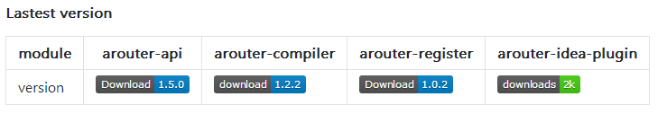

# Alibaba ARouter方案踩坑记
## ARouter能干什么？
Router是什么？就是路由，想想家里的路由器，家里设备都是连到这台路由器上，每台设备就都可以连接外部互联网，外部互联网上的其他人也可以向家里各个设备互联，路由器就是管理、转发这些消息从哪来（谁发的），到哪去（发给谁）。呃，好吧，这是我自己的理解，勿喷勿怪！

在传统的Android开发中，比如启动一个Activity通常有2种方式：

（1）显式Intent跳转，也是最常用的：
```java
Intent intent = new Intent(this, SeconeActivity.class); 
intent.putExtra("ketName", value);
startActivity(intent);
```
（2）隐式Intent跳转：
```java
Intent intent = new Intent();
intent.setAction(String actionName);
// addCategory可选，可添加多个
intent.addCategory(String category);
startActivity(intent);
```
同时，隐式Intent跳转的目标Activity必须在对应的AndroidManifest.xml声明中添加intent-filter过滤规则。（如上，假设SecondActivity为目标Activity，则需将其声明如下）：
```xml
<activity
    android:name="...path...SecondActivity" >
    <intent-filter>
        <action android:name="YourActionName" />
        <category android:name="android.intent.category.DEFAULT" />
        <!-- 如需category，可以自行添加 -->
        <category android:name="YourCategoryName1" />
        <category android:name="YourCategoryName2" />
    </intent-filter>
</activity> 
```
隐式Intent的优势在于，跳转动作的 **执行者** 无需依赖 **跳转目标**，即无需产生对SecondActivity的引用。

以上实现方式在过去可能问题不大，但是随着技术的不断演进、工程复杂度的增大，问题会越来越多，你肯定会遇到以下一个或数个问题：

（1）显式Intent不如当初那么好用了！

显式Intent使用简单，方便快捷，这在单Module开发中显然没什么问题。但随着业务复杂度的提高，如果所有代码还混杂在一个app Module中，显然会让维护成本像野草一样疯长。别说是新介入代码的同事，就是让你整理上个月的代码或是增加一个小需求，你都会头痛欲裂，因为你不得不把大片大片的逻辑从头再理一遍。

这种情况下，模块化开发（高大上的名字，其实就是多Module）应运而生，我们会把登录、支付、分享...这些通用的功能封装起来放到单独的Module中。此时，如果用显式Intent，必然使得普通业务模块都要依赖这几个公共模块，加上其他业务模块的依赖，会使得Module间的依赖关系变得混乱不堪。更要命的是，**循环依赖**的问题——
    
    如A模块需要跳转B模块的页面，使用显式Intent就必须让A依赖B模块；
    如果此时在B中进行某些逻辑后又需要进入A模块的某个页面，这时又要求B依赖A模块。
显然这在编译时会报循环依赖。

要么，你可以将这2个Module整合到一个中，但这似乎产生一个悖论，因为当初就是因为要做模块化，将功能划分到各Module中的；

要么，你可以在A模块中使用 
startActivityForResult(Intent intent, int requtstCode) 进入B模块，然后使用 onActivityResult(int requestCode, int resultCode, Intent data) 根据 B 模块返回的结果来模拟从B到A的跳转。试想一下，当业务较为复杂时，这简直就是个逻辑黑洞！

（2）隐式Intent并不是那么好管理

隐式Intent的 action、category都要在Activity、Service的声明中添加 intent-filter，所以这些都是在 AndroidManifest.xml中集中管理的。一个组件可以有多个 intent-filter 过滤，intent只要能匹配其中一个就可以进行跳转。

可能为了不同 Module调用设置了不同的 inteng-filter的，那么便产生了很多过滤条件；

可能有人对某个intent-filter做了更改（删除category不可怕，可怕的是增加了category），那么你必须为每个隐式Intent增加addCategory对应的值，否则匹配失败。

即使没有那些可能，当隐式Intent用多了，天知道哪个Intent能匹配上哪个组件，都是匿名者，全他娘的成了盲人摸象！

（3）触发了startActivity()后我们彻底失去了控制权

都知道，要启动一个组件，只需要 startActivity() 或 startService()，剩下的就交给系统来处理了，至于组件未在 AndroidManifest中注册、未匹配到 intent-filter等等问题导致的崩溃，开发者完全无法干涉。若想做报错降级什么的，就都是奢望了。

## 正常的ARouter方案接入
先去 [ARouter官网](https://github.com/alibaba/ARouter) 看看最新版本信息：



算了，集成过程不写了，官网就有，直接照着来就是了，只说说需要留意的地方：

（1）用到 ARouter 的 Module 都要添加依赖：
```
dependencies {
    implementation 'com.alibaba:arouter-api:newVersionCode'
    annotationProcessor 'com.alibaba:arouter-compiler:newVersionCode'
}
```
并且在 defaultConfig配置项下添加 javaCompileOptions 结点，如下：
```
android {
    defaultConfig {
        ...
        javaCompileOptions {
            annotationProcessorOptions {
                arguments = [AROUTER_MODULE_NAME: project.getName()]
            }
        }
    }
}
```
但是没有用到路由的 Module 其实是不用添加这些配置的，保持代码干净整洁。比如我的项目中有2个基础库 Module，用于放置通用的工具类、UI元素什么的，所有的业务 Module都会依赖这2个库，所以完全用不到 ARouter配置。

（2）其实为了方便管理，可以把 arouter-api 的依赖通过传递依赖放到基础库中，即基础库添加依赖，别的业务库依赖基础库：
```
api 'com.alibaba:arouter-api:newVersionCode'
```
然后各业务 Module中就成了：
```
android {
    defaultConfig {
        ...
        javaCompileOptions {
            annotationProcessorOptions {
                arguments = [AROUTER_MODULE_NAME: project.getName()]
            }
        }
    }
}

...
dependencies {
    ...
    implementation 'com.alibaba:arouter-api:newVersionCode'
    annotationProcessor 'com.alibaba:arouter-compiler:newVersionCode'
}
```
（3）**app要添加对各业务 Module的依赖**

不管是直接依赖还是间接依赖，各业务的 Module一定要被app依赖，否则那个没被依赖的业务 Module 会在打包时被当成没用的资源扔掉。在了解 ARouter的内部原理之前，可以这么理解（反正我就是这么理解的）：

1. 以app Module作为工程的顶层 Module；
2. 递归扫描 Module的依赖关系（可能类似于金字塔的形状，app在最顶，或者倒置的树），确定哪些 Module需要编译；
3. 从最底层 Module开始编译各个Module，编译过程中 ARouter扫描有 @Route(path = /xx/xx)注解的组件，生成**路由表**备用；
4. 在使用路由时，根据指定的 path 到路由表中查找对应组件。 

如果你的某个业务 Module没有被 app依赖（不管直接还是间接依赖），那么久不会在依赖关系的金字塔中，必然不会生成到路由表中，在匹配的时候就会报“**There's no route matched!**”。

## 遇到的问题
（1）编译报错：
```
> Task :test_demo:compileDebugJavaWithJavac FAILED

Gradle may disable incremental compilation as the following annotation processors are not incremental: butterknife-compiler-9.0.0.jar (com.jakewharton:butterknife-compiler:9.0.0), arouter-compiler-1.2.2.jar (com.alibaba:arouter-compiler:1.2.2), auto-service-1.0-rc2.jar (com.google.auto.service:auto-service:1.0-rc2).

Consider setting the experimental feature flag android.enableSeparateAnnotationProcessing=true in the gradle.properties file to run annotation processing in a separate task and make compilation incremental.

注: ARouter::Compiler >>> AutowiredProcessor init. <<<
错误: ARouter::Compiler An exception is encountered, [These no module name, at 'build.gradle', like :
  android {
      defaultConfig {
          ...
          javaCompileOptions {
              annotationProcessorOptions {
                  arguments = [AROUTER_MODULE_NAME: project.getName()]
              }
          }
      }
  }
```
这个最简单，参考**接入流程中的注意项（1）**，报错也很明显，缺少 javaCompileOptions-annotationProcessorOptions 配置，看看哪个 build.gradle 添加了
> annotationProcessor 'com.alibaba:arouter-compiler:newVersionCode' 

却缺少 javaCompileOptions-annotationProcessorOptions 配置，找到位置加上即可。

（2）运行时Toast提示：
```
There's no route matched!
Path=[/xxx/xxxx]
Group=[xxx]
```
参考接入注意事项，排查顺序（1）（2）（3）。

（3）Sync时发生警告：
```
WARNING: API 'variantOutput.getProcessResources()' is obsolete and has been replaced with 'variantOutput.getProcessResourcesProvider()'.
It will be removed at the end of 2019.
For more information, see https://d.android.com/r/tools/task-configuration-avoidance.
To determine what is calling variantOutput.getProcessResources(), use -Pandroid.debug.obsoleteApi=true on the command line to display a stack trace.
```
这个应该是 gradle 版本升级后 api 有变化，ARouter中还使用了老版本的写法所致。具体还没搞懂，问题先留着。